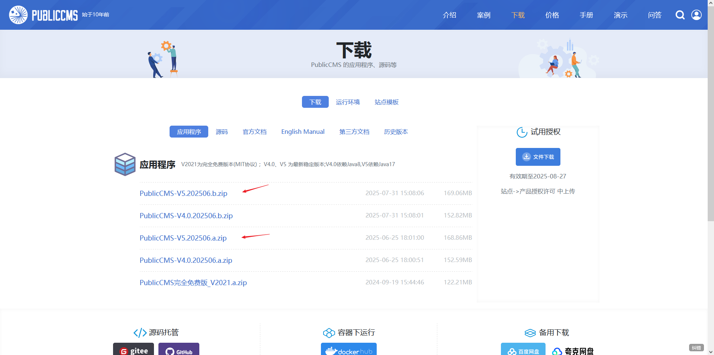
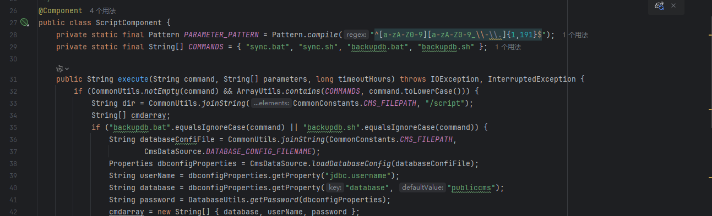
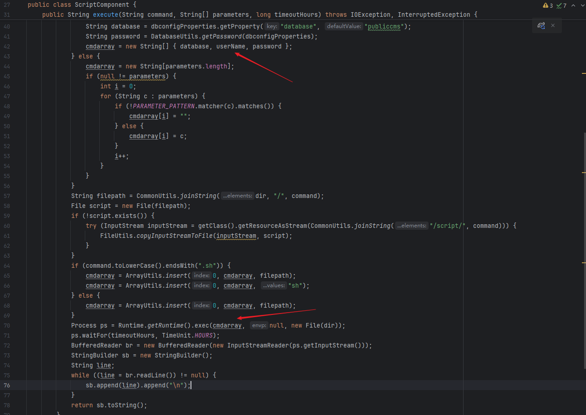
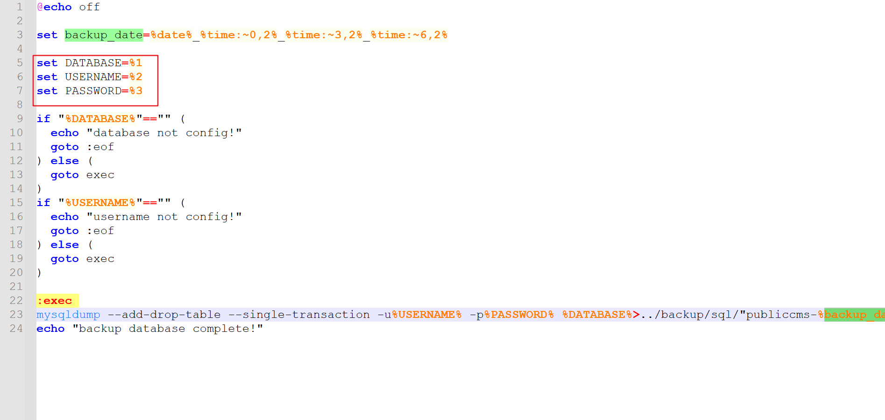
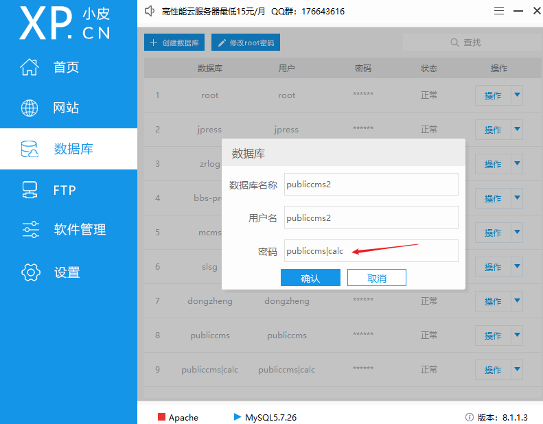
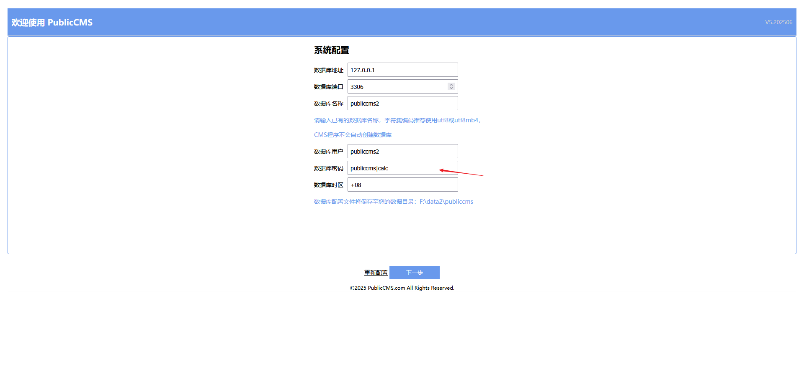
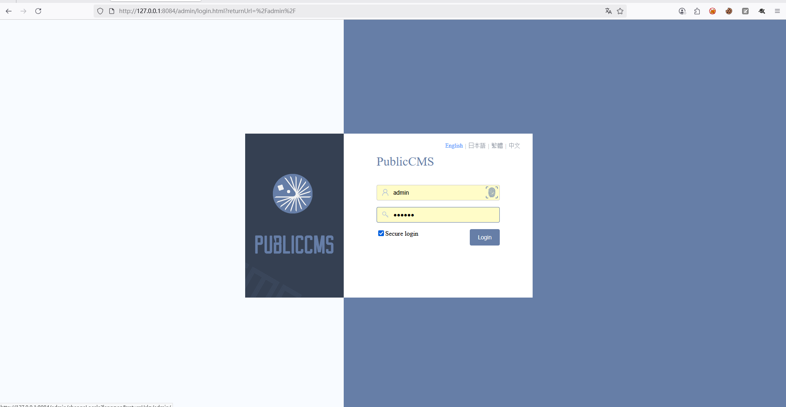
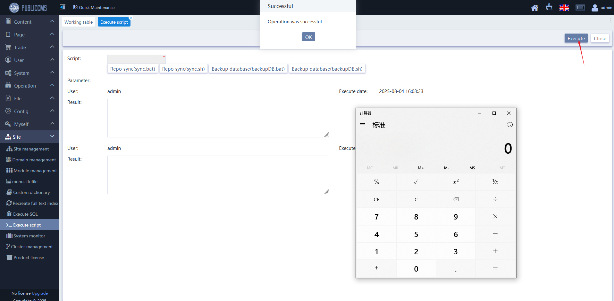
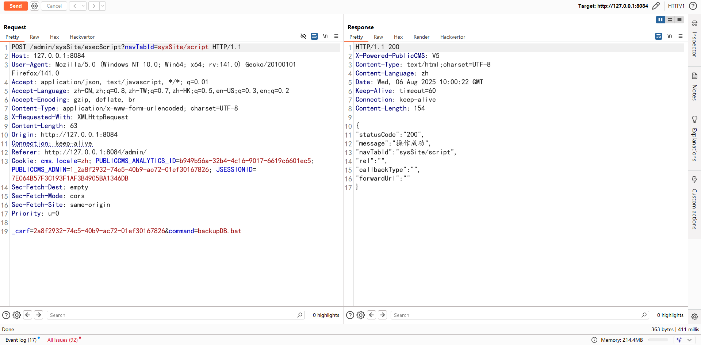
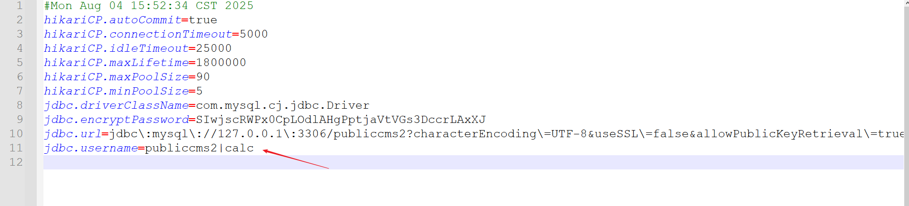

# The PublicCMS system has a command execution vulnerability

## Download Link
https://www.publiccms.com/download.html

Download the latest version PublicCMS-V5.202506.b

Only two of the latest versions have been tested, and both have this issue: PublicCMS-V5.202506.a and PublicCMS-V5.202506.b.

The following tests were conducted using the latest version, PublicCMS-V5.202506.b.

## Vulnerable Versions
PublicCMS-V5.202506.a, PublicCMS-V5.202506.b

## Vulnerability Principle

As shown in the figure below, when the file names are backupdb.bat and backupdb.sh, the value of cmdarray is a collection of the database name, database username, and database password. These values are not detected or filtered and are passed as parameters to the backupDB.bat file. Only the name of the file to be executed is verified.

The code, as shown in the figure, executes the backupDB.bat file.

The backupDB.bat file is shown in the figure below. The database name, database username, and database password are passed into this file as parameters and directly concatenated. The code is ultimately executed at the position marked by the red box in the image.

## Vulnerability Reproduction

1. Create a database using phpstudy with a password containing |calc, such as publiccms|calc. The same applies to the database name or username.

2. Install the system.

Enter the malicious database password as shown in the figure below.

3. After successful installation, log in to the backend.

4. Call the interface to execute commands.

Menu trigger location: Site - Execute Script

Vulnerable interface: http://127.0.0.1:8084/admin/sysSite/execScript?navTabId=sysSite/script

I am using a Windows system. Select backupDB.bat, click execute, and the vulnerability is successfully triggered.

Practical exploitation:
1. The target system is in a pending installation state.
2. Set up a database with a malicious password on a public network, such as publiccms|calc.
3. After successful setup, log in to the backend and call the vulnerable interface.

### Other Verification Methods

By directly modifying the database.properties file, such as changing jdbc.username to publiccms2|calc.

The vulnerability is also successfully triggered.

If developers use command separators when setting passwords, it can also cause issues.

## Fix Method
Restrict the use of command separators such as ;, &, | in database names, database usernames, and database passwords.
