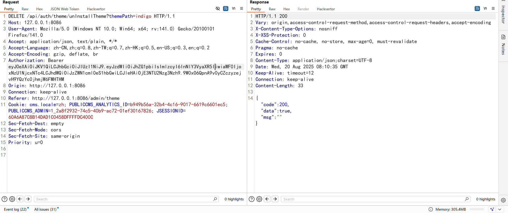

# Arbitrary File Deletion Vulnerability in PerfreeBlog System

## Official Website
https://perfree.org.cn/

## Download Link
https://gitee.com/PerfreeBlog/PerfreeBlog


## Vulnerability Description
The PerfreeBlog system has an arbitrary file deletion vulnerability, which allows deleting any files on the server.


## Vulnerable Version
Latest version 4.0.11


## Vulnerability Principle
The relevant code details are as follows:
Code for uninstalling theme files

When entering the `unInstallTheme` function, it directly concatenates the `themePath` without proper validation. It only checks if the directory or file exists, allowing directory traversal using `../` to delete files.


## Vulnerability Reproduction
First, log in to the background and navigate to Theme Management.


Click uninstall and capture the packet.


Create a 1.txt file in the root directory.


Modify `themePath` to achieve arbitrary file deletion.

Set `themePath` as:
```
themePath=indigo/../../../../../../../1.txt
```

File deletion request:
```
http://127.0.0.1:8086/api/auth/theme/unInstallTheme?themePath=indigo/../../../../../../../1.txt
```


Deletion successful.


Any file on the server can be deleted.
