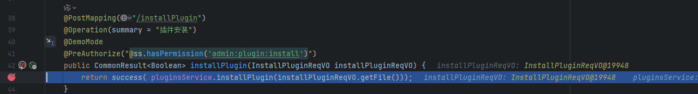
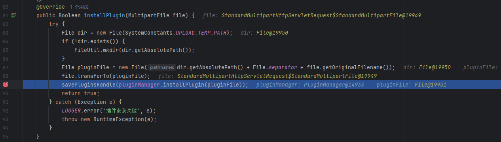
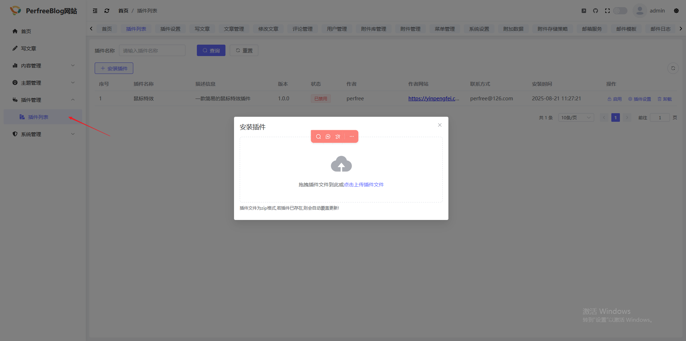
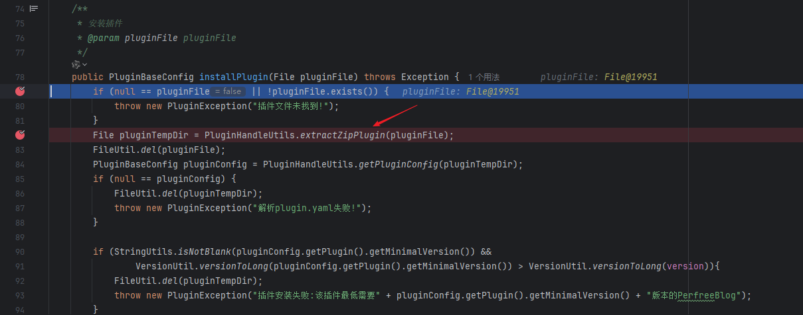
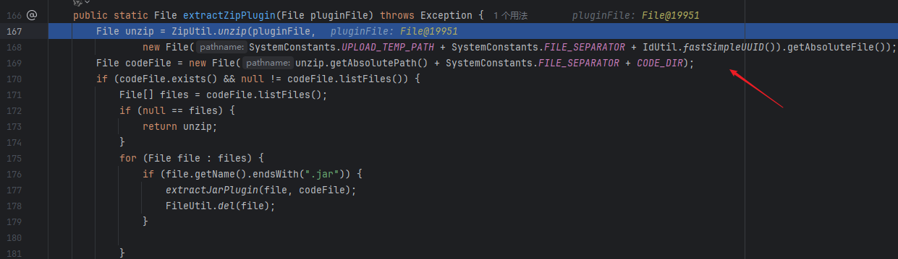
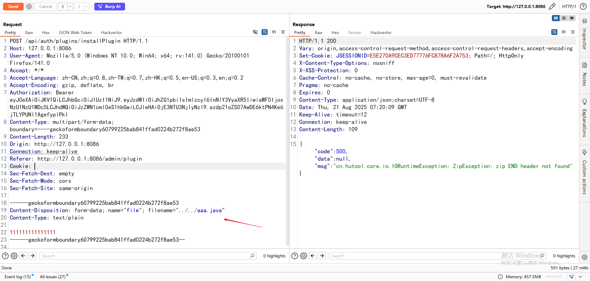
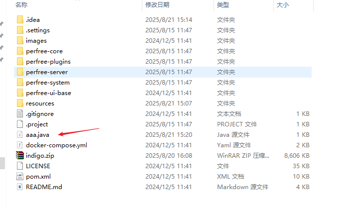

# Arbitrary File Write Vulnerability in PerfreeBlog System

## Official Website
https://perfree.org.cn/

## Download Link
https://gitee.com/PerfreeBlog/PerfreeBlog


## Vulnerability Description
The PerfreeBlog system has an arbitrary file write vulnerability, which allows writing any file to the server and gaining server privileges.


## Vulnerable Version
Latest version 4.0.11


## Vulnerability Principle
The relevant code details are as follows:
Code for saving theme file content

It is found that it uses the `validThemeFilePath` function to verify the legitimacy of the path.

When entering the `validThemeFilePath` function, it is found that the verification conditions are:
1. The path must exist and not be empty.
2. The incoming `path` must contain the `themePath`.

Therefore, path traversal can be achieved using `../`, and there is no verification of file suffixes.



## Vulnerability Reproduction
First, log in to the background and navigate to Theme Management.


Click "Save" and capture the packet.



Modify `path` and `themePath` to achieve arbitrary file writing.

Set `themePath` as:
```
default\\..\\..\\..\\..\\
```

File writing request:
http://127.0.0.1:8086/api/auth/theme/saveThemeFileContent

Demonstrated with a txt file; it is also possible to upload .java files to overwrite existing files to achieve RCE.
The `path` is:
```
File path + resources\\static\\themes\\default\\..\\..\\..\\..\\1.txt
```


Successful writing.


Of course, for Linux systems, it is possible to write cron jobs, public-private keys, etc., to gain server privileges.


It is also possible to overwrite any file through this interface, including Java files, to achieve code execution.
